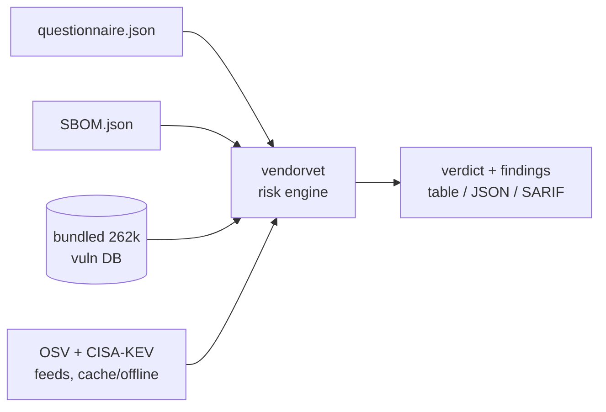

<a name="top"></a>
<div align="center">


# VENDORVET

### Third-party / vendor risk questionnaires with SBOM cross-ref


[](https://pypi.org/project/cognis-vendorvet/) [](https://github.com/cognis-digital/vendorvet/actions) [](LICENSE) [](https://github.com/cognis-digital)

*Compliance & GRC — get audit-ready and stay there, self-hosted.*

</div>

```bash
pip install cognis-vendorvet
vendorvet questionnaire vendor.json     # → residual risk score + tier in ms
vendorvet vulndb match sbom.json        # → SBOM vs 262k bundled vulns, offline
```


<!-- cognis:example:start -->
## 🔎 Example output

Real, reproducible output from the tool — runs offline:

```console
$ vendorvet-emit --version
vendorvet 0.1.0
```

```console
$ vendorvet-emit --help
usage: vendorvet [-h] [--version] [--format {table,json,sarif}]
                 {questionnaire,sbom,assess,feeds,vulndb} ...

SMB third-party risk vetting.

positional arguments:
  {questionnaire,sbom,assess,feeds,vulndb}
    questionnaire       Score a questionnaire JSON file.
    sbom                Cross-reference SBOM vs advisories.
    assess              Combined questionnaire + SBOM verdict.
    feeds               Real vuln feeds (OSV + CISA-KEV) for SBOM enrichment.
    vulndb              Bundled 262k-vuln DB lookups (fully offline, no
                        network/cache).

options:
  -h, --help            show this help message and exit
  --version             show program's version number and exit
  --format {table,json,sarif}
```

> Blocks above are real `vendorvet` output — reproduce them from a clone.

**Sample result format** _(illustrative values — run on your own data for real findings):_

```
{
"vendorvet": {
"findings": [
{
"id": "123456",
"name": "Suspicious Network Traffic",
"description": "Potential malicious activity detected on network interface 192.168.1.100",
"severity": "high"
},
{
"id": "789012",
"name": "Unusual File Access",
"description": "User 'johndoe' accessed file '/path/to/sensitive/data'",
"severity": "medium"
}
]
}
}
```

<!-- cognis:example:end -->

## Usage — step by step

1. **Install** (Python 3.9+):

   ```bash
   pip install vendorvet
   ```

2. **Score a security questionnaire.** Point `vendorvet questionnaire` at a vendor questionnaire JSON to get a residual risk score and tier:

   ```bash
   vendorvet questionnaire vendor_questionnaire.json
   ```

3. **Cross-reference an SBOM** against an advisory feed to find vulnerable components:

   ```bash
   vendorvet sbom vendor_sbom.json advisories.json
   ```

4. **Get a combined verdict** and read the output as JSON for tooling. `assess` merges the questionnaire with an optional SBOM:

   ```bash
   vendorvet --format json assess vendor_questionnaire.json --sbom vendor_sbom.json --advisories advisories.json | jq .tier
   ```

5. **Gate in CI.** The exit code is `0` for low/moderate risk, `2` for high/critical, and `1` on usage/IO errors — so a step fails the build when a vendor is high-risk:

   ```bash
   vendorvet assess vendor_questionnaire.json --sbom vendor_sbom.json --advisories advisories.json || echo "Vendor flagged high/critical risk"
   ```

6. **Export SARIF 2.1.0** for GitHub code scanning / any SARIF viewer. Add `--format sarif` to any subcommand:

   ```bash
   vendorvet --format sarif assess vendor_questionnaire.json \
       --sbom vendor_sbom.json --advisories advisories.json > vendorvet.sarif
   ```

   Each questionnaire gap and vulnerable component becomes a SARIF result; CVEs carry a `security-severity` property so GitHub renders the right badge. See [`demos/09-ci-gate-sarif`](demos/09-ci-gate-sarif) for a full Actions workflow.

## Worked examples (demos)

Every folder under [`demos/`](demos) is a runnable, real-use-case scenario
with a `SCENARIO.md` (where the data came from, the exact command, and the
expected verdict). They all use real, documented CVEs.

| Demo | Situation | Verdict |
|---|---|---|
| [`01-basic`](demos/01-basic) | SaaS with Log4Shell in its SBOM | CRITICAL (exit 2) |
| [`02-clean`](demos/02-clean) | Fully-attested vendor, zero gaps | LOW (exit 0) |
| [`03-mixed`](demos/03-mixed) | Mid-tier vendor, MFA/pentest gaps | MODERATE (exit 0) |
| [`04-payroll-saas`](demos/04-payroll-saas) | Strong payroll vendor, restricted PII, missing breach SLA | MODERATE (exit 0) |
| [`05-clean-vendor`](demos/05-clean-vendor) | Public-data vendor, patched SBOM | LOW (exit 0) |
| [`06-supply-chain-struts`](demos/06-supply-chain-struts) | SBOM-only: Apache Struts RCE (CVE-2017-5638) | CRITICAL (exit 2) |
| [`07-startup-unanswered`](demos/07-startup-unanswered) | Early-stage vendor leaves controls blank | HIGH (exit 2) |
| [`08-spring4shell`](demos/08-spring4shell) | Clean questionnaire, Spring4Shell in code | CRITICAL (exit 2) |
| [`09-ci-gate-sarif`](demos/09-ci-gate-sarif) | CI gate + SARIF upload (CVE-2021-45046) | CRITICAL (exit 2) |
| [`10-data-broker-restricted`](demos/10-data-broker-restricted) | Data broker, prior breach, shares data | HIGH (exit 2) |
| [`11-heartbleed-legacy`](demos/11-heartbleed-legacy) | Legacy appliance with Heartbleed OpenSSL | HIGH (exit 2) |
| [`12-feeds-osv-kev`](demos/12-feeds-osv-kev) | SBOM enriched from **live OSV + CISA-KEV** (runs offline) | CRITICAL (exit 2) |
| [`13-vulndb-offline`](demos/13-vulndb-offline) | SBOM matched against the **bundled 262k-vuln DB**, air-gapped (Struts CVE-2017-5638) | CRITICAL (exit 2) |

```bash
# run any demo straight from a clone
python -m vendorvet assess demos/08-spring4shell/questionnaire.json \
    --sbom demos/08-spring4shell/sbom.json \
    --advisories demos/08-spring4shell/advisories.json
```


## Live feed enrichment (OSV + CISA-KEV) — edge / air-gap ready

The `sbom`/`assess` subcommands above cross-reference an SBOM against a
*hand-supplied* advisory file. The `feeds` subcommand instead grounds the verdict
in **real, current** vulnerability intelligence pulled from two authoritative,
keyless sources, then re-serves them **offline** so the tool keeps working on
disconnected / edge / air-gapped gear.

| Feed id | Source | URL |
|---|---|---|
| `osv` | OSV.dev — package+version → known vulns across PyPI/npm/Maven/Go/crates.io/… | `https://api.osv.dev/v1/query` |
| `cisa-kev` | CISA Known Exploited Vulnerabilities catalog (actively exploited in the wild) | `https://www.cisa.gov/known-exploited-vulnerabilities-catalog` |

**Real enrichment:** every SBOM component is resolved against OSV for live
advisories; each CVE is then checked against CISA-KEV. A KEV hit raises a
`known_exploited` flag and escalates the verdict to **CRITICAL** regardless of
CVSS — a vulnerability under active exploitation is the single strongest
third-party-risk escalation signal.

```bash
vendorvet feeds list                       # the two feeds this tool consumes
vendorvet feeds update osv cisa-kev        # fetch + cache (online)
vendorvet feeds enrich vendor_sbom.json    # live OSV + KEV enrichment
```

```text
$ vendorvet feeds enrich demos/12-feeds-osv-kev/sbom.json --offline
Components scanned:    3
Max CVSS:              10.0 (critical)
Known-exploited (KEV): 2
Verdict:               CRITICAL
  org.apache.logging.log4j:log4j-core@2.14.1  CVE-2021-44228  CVSS 10.0 (critical)  [!! CISA-KEV: ACTIVELY EXPLOITED]
      remediate by 2021-12-24; ransomware: Known
  django@3.0  CVE-2020-9402  CVSS 7.5 (high)
```

Exit code is `2` when the verdict is high/critical (CI-gate friendly).

### Offline / air-gap workflow

`datafeeds` (bundled, stdlib-only) caches every fetch to disk and can re-serve it
with **zero network**:

```bash
export COGNIS_FEEDS_CACHE=/secure/feeds-cache     # where the cache lives
vendorvet feeds update osv cisa-kev               # on a connected host
vendorvet feeds enrich sbom.json --offline        # serve from cache only
```

To move intelligence into a disconnected enclave, snapshot the cache and carry it
across the air gap by sneakernet:

```bash
# connected host
python -m vendorvet.datafeeds snapshot-export feeds.tar.gz
# air-gapped host
export COGNIS_FEEDS_CACHE=/secure/feeds-cache
python -m vendorvet.datafeeds snapshot-import feeds.tar.gz
vendorvet feeds enrich sbom.json --offline
```

The committed test suite runs **fully offline** against trimmed fixtures under
[`tests/fixtures/feeds-cache/`](tests/fixtures/feeds-cache) — no test touches the
network. *Defensive / authorized-use intelligence only.*


## Contents

- [Why vendorvet?](#why) · [Features](#features) · [Quick start](#quick-start) · [Example](#example) · [Architecture](#architecture) · [AI stack](#ai-stack) · [How it compares](#how-it-compares) · [Integrations](#integrations) · [Install anywhere](#install-anywhere) · [Related](#related) · [Contributing](#contributing)

<a name="why"></a>
## Why vendorvet?

TPRM for SMBs

`vendorvet` is single-purpose, scriptable, and self-hostable: point it at a target, get prioritized results in the format your workflow already speaks (table · JSON · SARIF), gate CI on it, and let agents drive it over MCP.

<div align="right"><a href="#top">↑ back to top</a></div>

<a name="features"></a>
## Features

- ✅ Score security questionnaires (weighted controls, inherent-risk multiplier)
- ✅ Cross-reference SBOMs against an advisory feed (exact-version matching)
- ✅ **Offline match against a bundled 262k-record real OSV/GHSA vuln DB** (`vulndb`) — zero network, air-gap ready
- ✅ Live enrichment from **OSV + CISA-KEV** with cache + `--offline` (`feeds`)
- ✅ Combined vendor verdict (questionnaire + SBOM) with recommendation
- ✅ Output as **table · JSON · SARIF 2.1.0** (`--format`)
- ✅ CI-friendly exit codes (0 / 2 / 1) for procurement gates
- ✅ 12 runnable real-use-case demos in [`demos/`](demos)
- ✅ Runs on Linux/macOS/Windows · Docker · devcontainer
- ✅ Ports in Python, JavaScript, Go, Rust, and Shell (`ports/`), CI-verified for parity

<div align="right"><a href="#top">↑ back to top</a></div>

<a name="quick-start"></a>
## Quick start

```bash
pip install cognis-vendorvet
vendorvet --version
vendorvet questionnaire vendor.json                 # score a questionnaire
vendorvet --format json questionnaire vendor.json   # machine-readable
vendorvet assess vendor.json --sbom sbom.json --advisories adv.json  # combined verdict
vendorvet vulndb match sbom.json                    # offline 262k-vuln DB match
vendorvet feeds enrich sbom.json                    # live OSV + CISA-KEV enrichment
```

Exit code is `0` for low/moderate, `2` for high/critical, `1` on usage/IO error —
so any subcommand doubles as a CI gate.

<div align="right"><a href="#top">↑ back to top</a></div>

<a name="example"></a>
## Example

```text
$ vendorvet questionnaire demos/07-startup-unanswered/questionnaire.json
Vendor:           Seedling Analytics
Data class:       confidential (x1.1)
Controls answered:3/14
Residual score:   48.83/100
Risk tier:        HIGH
Gaps:
  - SOC 2 Type II report on file (unanswered)
  - Independent pen test within 12 months (unanswered)
  - ...
```

```text
$ vendorvet vulndb match demos/12-feeds-osv-kev/sbom.json
Components scanned: 3
Matched vulns:      186
Max CVSS:           10.0 (critical)
Verdict:            CRITICAL
(source: bundled cognis_vulndb.jsonl.gz - fully offline)
  [Maven] org.apache.logging.log4j:log4j-core@2.14.1  CVE-2021-44228  CVSS 10.0 (critical)
  [PyPI] django@3.0  CVE-2022-28346  CVSS 9.8 (critical)
  ...
```

<div align="right"><a href="#top">↑ back to top</a></div>

<a name="architecture"></a>
## Architecture



<div align="right"><a href="#top">↑ back to top</a></div>

<a name="ai-stack"></a>
## Use it from any AI stack

`vendorvet` is interoperable with every popular way of using AI:

- **MCP server** — `vendorvet mcp` (Claude Desktop, Cursor, Cognis.Studio, [uncensored-fleet](https://github.com/cognis-digital/uncensored-fleet))
- **OpenAI-compatible / JSON** — pipe `vendorvet --format json assess vendor.json` into any agent or LLM
- **LangChain · CrewAI · AutoGen · LlamaIndex** — wrap the CLI/JSON as a tool in one line
- **CI / scripts** — exit codes + SARIF for non-AI pipelines

<div align="right"><a href="#top">↑ back to top</a></div>

<a name="how-it-compares"></a>
## How it compares

| | **Cognis vendorvet** | OneTrust TPRM |
|---|:---:|:---:|
| Self-hostable, no account | ✅ | varies |
| Single command, zero config | ✅ | ⚠️ |
| JSON + SARIF for CI | ✅ | varies |
| MCP-native (AI agents) | ✅ | ❌ |
| Polyglot ports (JS/Go/Rust) | ✅ | ❌ |
| Open license | ✅ COCL | varies |

*Built in the spirit of **OneTrust TPRM**, re-framed the Cognis way. Missing a credit? Open a PR.*

<div align="right"><a href="#top">↑ back to top</a></div>

<a name="integrations"></a>
## Integrations

Pipes into your stack: **SARIF** for code-scanning, **JSON** for anything, an **MCP server** (`vendorvet mcp`) for AI agents, and a webhook forwarder for SIEM/Slack/Jira. See [`docs/INTEGRATIONS.md`](docs/INTEGRATIONS.md).

<div align="right"><a href="#top">↑ back to top</a></div>

<a name="install-anywhere"></a>
## Install — every way, every platform

```bash
pip install "git+https://github.com/cognis-digital/vendorvet.git"    # pip (works today)
pipx install "git+https://github.com/cognis-digital/vendorvet.git"   # isolated CLI
uv tool install "git+https://github.com/cognis-digital/vendorvet.git" # uv
pip install cognis-vendorvet                                          # PyPI (when published)
docker run --rm ghcr.io/cognis-digital/vendorvet:latest --help        # Docker
brew install cognis-digital/tap/vendorvet                             # Homebrew tap
curl -fsSL https://raw.githubusercontent.com/cognis-digital/vendorvet/main/install.sh | sh
```

| Linux | macOS | Windows | Docker | Cloud |
|---|---|---|---|---|
| `scripts/setup-linux.sh` | `scripts/setup-macos.sh` | `scripts/setup-windows.ps1` | `docker run ghcr.io/cognis-digital/vendorvet` | [DEPLOY.md](docs/DEPLOY.md) (AWS/Azure/GCP/k8s) |

<div align="right"><a href="#top">↑ back to top</a></div>

<a name="related"></a>
## Related Cognis tools

- [`soc2box`](https://github.com/cognis-digital/soc2box) — SOC 2 evidence collector and control tracker, self-hosted
- [`gdprkit`](https://github.com/cognis-digital/gdprkit) — GDPR/CCPA DSAR, RoPA, and cookie-consent toolkit
- [`policyforge`](https://github.com/cognis-digital/policyforge) — Auto-generate security policies from a short questionnaire
- [`auditrail`](https://github.com/cognis-digital/auditrail) — Tamper-evident audit-log aggregator with hash-chained attestation
- [`frameworkmap`](https://github.com/cognis-digital/frameworkmap) — Crosswalk controls across NIST, ISO 27001, SOC 2, CMMC, PCI
- [`dpiaforge`](https://github.com/cognis-digital/dpiaforge) — DPIA and EU AI Act impact-assessment generator

**Explore the suite →** [🗂️ all 170+ tools](https://github.com/cognis-digital/cognis-neural-suite) · [⭐ awesome-cognis](https://github.com/cognis-digital/awesome-cognis) · [🔗 cognis-sources](https://github.com/cognis-digital/cognis-sources) · [🤖 uncensored-fleet](https://github.com/cognis-digital/uncensored-fleet) · [🧠 engram](https://github.com/cognis-digital/engram)

<div align="right"><a href="#top">↑ back to top</a></div>

<a name="contributing"></a>
## Contributing

PRs, new rules, and demo scenarios are welcome under the collaboration-pull model — see [CONTRIBUTING.md](CONTRIBUTING.md) and [SECURITY.md](SECURITY.md).

> ### ⭐ If `vendorvet` saved you time, **star it** — it genuinely helps others find it.

## Interoperability

`vendorvet` composes with the 300+ tool Cognis suite — JSON in/out and a shared
OpenAI-compatible `/v1` backbone. See **[INTEROP.md](INTEROP.md)** for the
suite map, composition patterns, and reference stacks.

## License

Source-available under the **Cognis Open Collaboration License (COCL) v1.0** — free for personal, internal-evaluation, research, and educational use; **commercial / production use requires a license** (licensing@cognis.digital). See [LICENSE](LICENSE).

---

<div align="center"><sub><b><a href="https://cognis.digital">Cognis Digital</a></b> · one of 170+ tools in the <a href="https://github.com/cognis-digital/cognis-neural-suite">Cognis Neural Suite</a> · <i>Making Tomorrow Better Today</i></sub></div>

## Bundled vulnerability database — 262k real vulns, fully offline

Where the `feeds` subcommand pulls *live* OSV + CISA-KEV (cache-backed), the
`vulndb` subcommand resolves an SBOM against a **bundled** corpus that ships
inside the wheel: `vendorvet/cognis_vulndb.jsonl.gz` — **262,351 real
vulnerabilities** consolidated from OSV across **npm · PyPI · Go · Maven ·
crates.io · RubyGems · NuGet**, each with CVE/GHSA aliases, ecosystem, CVSS
severity vector, affected packages, and publish/modify dates. No network, no
cache priming, no key — grounded results the moment you clone. This is the true
**air-gap / clean-room** path.

```bash
vendorvet vulndb stats                         # summarize the bundle
vendorvet vulndb cve CVE-2021-44228            # look up a CVE / GHSA id
vendorvet vulndb package django --ecosystem PyPI
vendorvet vulndb match sbom.json               # match an SBOM, offline
```

```text
$ vendorvet vulndb stats
Bundled vulnerability database (offline):
  records:          262351
  with CVE alias:   30124
  with severity:    25639
  ecosystems:
    npm            221314
    PyPI           20698
    Go             7271
    Maven          6692
    crates.io      2546
    RubyGems       2066
    NuGet          1764
```

The pure-stdlib loader `vendorvet.vulndb_local.VulnDB`
(`count`/`by_cve`/`by_package`/`search`) is importable directly. Refresh or
extend the corpus from NVD/OSV/GHSA with the bundled `datafeeds` module — see
the offline / air-gap workflow above.

## Scope, authorization & safety

`vendorvet` is a **passive, offline** third-party-risk tool. It reads
questionnaires, SBOMs, and bundled/cached vulnerability data and produces a
verdict. **It performs no active scanning, network probing, or exploitation** —
the `feeds` subcommand only *fetches published advisory feeds* (OSV/CISA-KEV)
over HTTPS and caches them; `vulndb`, `questionnaire`, `sbom`, and `assess` make
**no network calls at all**. Use it for defensive, authorized third-party risk
management. All bundled vulnerability data is real (OSV/GHSA/CISA-KEV); nothing
is fabricated. The committed test suite runs fully offline and never touches the
network.
